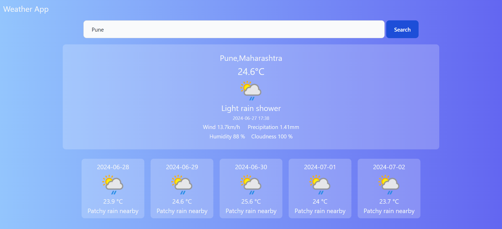

# Weather App

## Description

The Weather App is a simple, responsive web application that allows users to search for and view the current weather and a 5-day forecast for any city. The application uses the WeatherAPI to fetch real-time weather data.

## Features

- Search for current weather and 5-day forecast by city
- Display current temperature, weather conditions, wind speed, humidity, and more
- Responsive design with a clean, modern UI
- Error handling for invalid city searches

## Technologies Used

- React
- Axios
- WeatherAPI
- Tailwind CSS

## Installation

1. **Clone the repository:**

   ```sh
   git clone https://github.com/your-username/weather-app.git
   cd weather-app
   ```

2. **Install dependencies:**

   ```sh
   npm install
   ```

3. **Add your WeatherAPI key:**

   Replace `YOUR_API_KEY` in `Current.js` with your actual WeatherAPI key:

   ```javascript
   const response = await axios.get(
     `https://api.weatherapi.com/v1/forecast.json?key=YOUR_API_KEY&q=${city}&days=6&aqi=no&alerts=no`
   );
   ```

4. **Run the application:**

   ```sh
   npm start
   ```

## Usage

1. Open the application in your web browser at `http://localhost:3000`.
2. Enter a city name in the search bar and click "Search".
3. View the current weather and 5-day forecast for the entered city.

## Screenshot



## File Structure

- `src/`
  - `components/`
    - `Current.js`: Component to display current weather and forecast
    - `ForecastCards.js`: Component to display individual forecast cards
  - `App.js`: Main application component
  - `App.css`: CSS file for styling

## Contributing

1. Fork the repository
2. Create your feature branch (`git checkout -b feature/your-feature`)
3. Commit your changes (`git commit -m 'Add some feature'`)
4. Push to the branch (`git push origin feature/your-feature`)
5. Open a pull request

## License

This project is licensed under the MIT License.

## Acknowledgments

- [WeatherAPI](https://www.weatherapi.com/) for providing the weather data
- [Tailwind CSS](https://tailwindcss.com/) for the styling framework

---
